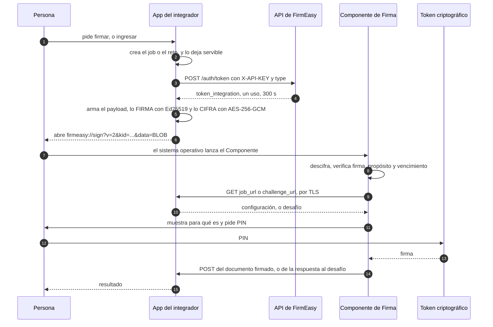
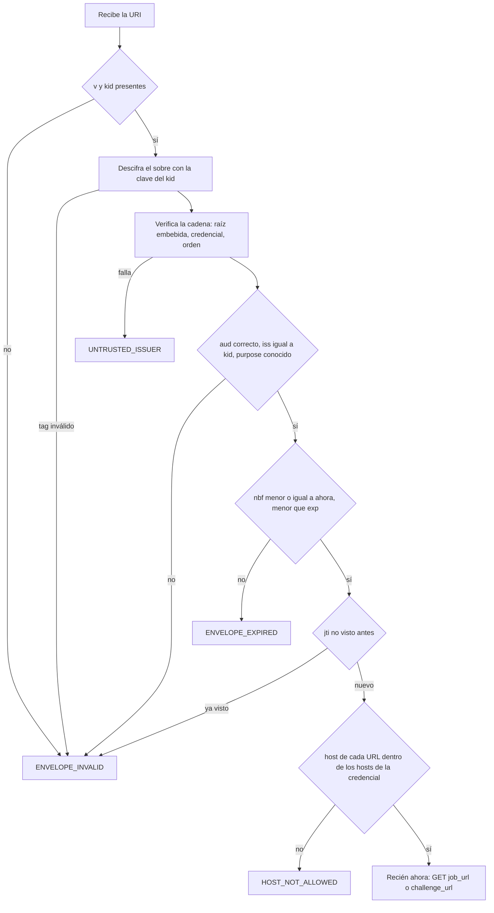
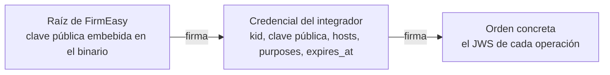
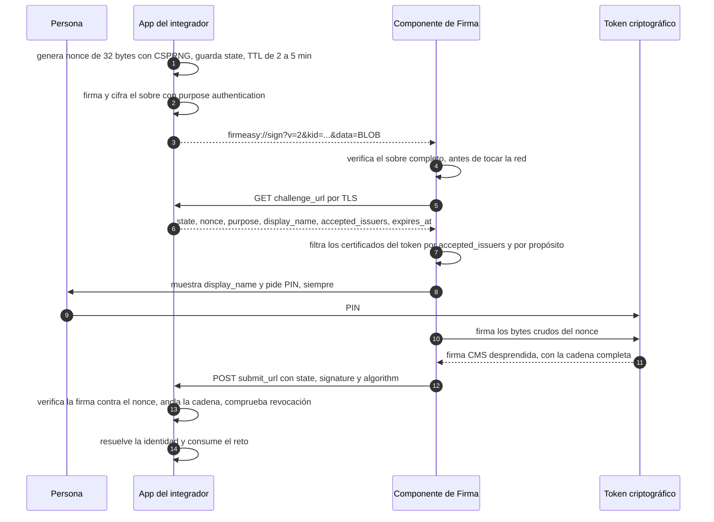

# Autenticación en la v2 del protocolo: sobre firmado y ceremonia de ingreso

> **Al 2026-09-03.** Escrito contra el manual **`Componente de Firma – ANDROID – IPHONE`, V 1.0.0
> (05/08/2026)**, que es donde aparece por primera vez la forma de la v2 —token de integración,
> `JOB_URL` y URI cifrada—, y contra el Componente de escritorio
> `GirasolPESCRL.FirmEasySigner 1.0.0.0` con el manual `FirmEasy_Protocolo_URIv2` V 1.0.1.0, que es
> lo que hay hoy. Describe **una versión concreta en una fecha concreta**: si lo estás leyendo con
> una posterior, verificá antes de creerle.

## 0. Para qué es este documento

El manual móvil ya define cómo viajan los parámetros en la v2. Lo que no define —y es lo que
necesitamos antes de construir del lado nuestro— es **cómo se autentica**: ni cómo el Componente
sabe que una orden viene de quien dice venir, ni cómo una aplicación lo usa para que una persona
**ingrese** con su certificado en vez de solo firmar un documento.

Acá va eso: el diagnóstico de lo que falta, el flujo de integración completo, los algoritmos fijados
con sus parámetros, los diagramas, y las preguntas que solo ustedes pueden contestar.

**Está escrito al revés de un manual, a propósito.** Primero el problema y las propiedades que
necesitamos, que es lo que no podemos negociar; después una forma concreta que las cumple, que sí es
negociable. Si el Componente ya tiene —o planea— otra manera de cumplirlas, nos sirve igual.

---

## 1. Lo que ya define el manual móvil

Para no discutir de memoria, esto es lo que leímos y damos por dado:

| Pieza | Cómo está definida |
|---|---|
| **Token de integración** | `POST https://enterprise.digital.firmeasy.legal/api/v1/auth/token`, header `X-API-KEY` —secreto de producción, por cliente—, cuerpo `{"type": "individual"}` o `{"type": "batch"}` → `{token, expires_in: 300, type}`. Expira al primer uso o a los 300 s, lo que ocurra primero. |
| **URI** | `firmeasy://sign?data={JOB_URL}&exp={EXP}&token={TOKEN_INTEGRATION}` |
| **`JOB_URL`** | Un GET del integrador que devuelve `{job, configuration{…}, documents[]{from, to, name_pdf, doc_sha256, settings{vis_sig_*}}}` |
| **Cifrado (§2.2)** | AES-256-GCM. `BLOB_RAW = IV(12) || CIPHERTEXT || AUTH_TAG(16)`, `BLOB = base64url(BLOB_RAW)`, URI final `firmeasy://sign?data=BLOB`. La KEY la entrega FirmEasy y **«es única y compartida entre todos los clientes que integran el componente»**. |

Tres decisiones de ahí nos parecen acertadas y no las tocamos: que la configuración se **baje** por
`JOB_URL` en vez de viajar en la URI, que exista un **`doc_sha256`** por documento, y que el token de
integración sea **de un solo uso y corto**.

## 2. El diagnóstico: tres propiedades que se confunden en una palabra

«Autenticar» está haciendo el trabajo de tres cosas distintas, y la v2 hoy cubre una:

| Propiedad | Qué garantiza | Con qué se consigue | ¿Está en la v2? |
|---|---|---|---|
| **Confidencialidad** | nadie que vea la URI lee los parámetros | cifrado (AES-256-GCM) | ✅ |
| **Autenticidad del origen** | el Componente sabe que la orden la emitió **ese** integrador | **firma asimétrica** (Ed25519) | ❌ |
| **Prueba de posesión** | el servidor sabe que quien respondió tiene el token criptográfico | desafío fresco + firma CMS | ❌ (la operación no existe) |

Ninguna sustituye a otra. **Cifrar oculta; no dice quién habla.**

### 2.1 Por qué una KEY simétrica compartida no autentica

El §2.2 del manual móvil dice que la KEY es **una sola para todos los integradores**. Cuatro
consecuencias, y ninguna se arregla con una clave más larga:

1. **Cualquier integrador puede hacerse pasar por otro.** Con la misma clave se cifra y se descifra:
   quien puede armar su propia URI puede armar la de cualquiera. El `AUTH_TAG` de GCM prueba
   integridad **respecto de esa clave**, y esa clave la tiene todo el mundo.
2. **La clave también está en el Componente instalado**, porque necesita descifrar. Vive entonces en
   cada teléfono, en cada máquina de escritorio y en el servidor de cada integrador. Que del binario
   de escritorio se pueden leer cadenas ya lo comprobamos: así encontramos el modo `sign_data` y la
   lista de hosts (§2.3).
3. **Un compromiso es global, y la rotación también.** Filtrada una vez, se filtró para todos los
   clientes; y cambiarla obliga a coordinar el mismo día a todos los integradores y a todas las
   instalaciones.
4. **GCM no admite repetir el par (clave, IV).** Con IV de 12 bytes aleatorios el margen se cuenta
   sobre **todos los mensajes cifrados con esa clave**; con una clave global ese conteo es la suma de
   todos los integradores juntos, no el de cada uno. Una clave por integrador no es solo mejor
   higiene: reduce el problema al tamaño de un cliente.

Y lo que está en juego no es leer una URI. Una orden forjada, en una máquina que tiene el token
conectado, es **una firma con el certificado de una persona sobre un documento que ella no eligió**.

**Cómo cifrar es decisión de ustedes y no nos metemos**: es su protocolo, ya está resuelto, y lo
tomamos como venga. Lo que sí nos toca a los dos es **cómo se autentica el origen**,
porque de eso depende que una orden nuestra no la pueda fabricar otro. Y ahí la recomendación es una
sola: **criptografía asimétrica**. Quien emite guarda una clave privada, el Componente conserva solo
la pública, y no queda ningún secreto que repartir entre integradores ni que rotar en conjunto el
mismo día.

Si además quieren conservar el cifrado, lo asimétrico también gana ahí —cifrar contra una clave
pública del Componente—, porque ningún integrador necesita compartir una clave con los demás ni con
ustedes. Pero eso ya es una preferencia; lo otro no.

### 2.2 Dos detalles más, del mismo tamaño pero más fáciles

- **`exp` y `token` viajan fuera del blob** en el ejemplo del §2 (`?data=…&exp=…&token=…`), mientras
  el §2.2 dice cifrar la URI. Lo que quede afuera se puede editar: se corre el `exp` y el vencimiento
  deja de existir. Va todo adentro —o lo que quede afuera, atado como AAD (§4)—.
- **`doc_sha256` ata el documento, pero nada ata el `JOB_URL`.** Quien pueda cambiar la URI cambia el
  job entero, con sus hashes incluidos. El sobre tiene que cubrir también **a dónde se va a buscar la
  configuración**.

### 2.3 La pieza correcta ya la tienen

Leyendo las cadenas del binario de escritorio —viven en UTF-16, por eso un `grep` ASCII no las
encuentra— apareció un **cuarto modo de protocolo que el manual V 1.0.1.0 no documenta**. El despacho
es por parámetro presente: `check` para verificación de instalación, `from` para firma unitaria —que
sus propios registros llaman *«legacy»*—, `batch_csv` para el lote, y **`sign_data`**, un payload
firmado con **Ed25519** y verificado por `kid` contra una clave pública embebida en el binario.

Eso es exactamente lo que falta en el flujo de la v2, y ya está construido. Firma asimétrica: quien
emite tiene la privada, el Componente solo la pública, y nadie puede fabricar una orden por el hecho
de poder leerla.

En el mismo lugar aparece una **lista de hosts** (`staging.firmeasy.legal`, `storage.girasol.pe`,
`pki.girasol.pe`, `dev-storage.girasol.pe`, `raw.githubusercontent.com`, `girasoltest.vercel.app`).
Hoy **no es una allowlist dura**: en las tres corridas que medimos, un servidor en
`http://localhost:4310` funcionó igual. El §7 explica por qué conviene decidir qué hacer con eso
antes de que un día lo sea.

## 3. El flujo de integración, de punta a punta

Dos fases: el alta ocurre una vez; el resto, en cada operación.

### 3.1 Alta del integrador (una sola vez)

FirmEasy le entrega a cada aplicación que se integra:

| Dato | Para qué | ¿Secreto? |
|---|---|---|
| `X-API-KEY` | pedir tokens de integración | sí, solo en el servidor |
| `kid` | identificar al integrador en la URI | no |
| **clave privada Ed25519** —la genera el integrador; FirmEasy nunca la ve— | firmar cada orden | sí, solo en el servidor |
| **credencial de integrador**, firmada por FirmEasy | que el Componente verifique la orden sin consultar nada en línea | no |
| clave AES-256 **propia del integrador**, si se conserva el cifrado | confidencialidad | sí |

En el alta el integrador declara sus **hosts** —los dominios desde los que servirá `JOB_URL`, `from`,
`to`— y FirmEasy los firma dentro de la credencial. El §7 explica por qué eso importa más de lo que
parece.

### 3.2 Cada operación



Lo único que cambia entre firmar y autenticar es **el propósito declarado en el sobre** y lo que
viaja de los pasos 9 a 14. El transporte es el mismo, y eso es deliberado: un solo mecanismo, dos
operaciones.

## 4. El sobre

Llamamos **sobre** a lo que en el manual móvil es `data=BLOB`: el paquete que reemplaza a los
parámetros sueltos de la URI y lleva adentro toda la orden. Es una pieza del transporte entre el
servidor del integrador y el Componente; **no tiene ninguna relación con el token ni con el
certificado de la persona**, que aparecen recién en el §8.

La forma que proponemos, respetando el vocabulario del manual móvil:

```
firmeasy://sign?v=2&kid=<id del integrador>&data=<BLOB>
```

- **El sobre se cifra como ustedes decidan.** Damos por dado el `BLOB = base64url(IV(12) ||
  CIPHERTEXT || AUTH_TAG(16))` del §2.2 del manual y no lo tocamos; todo lo que sigue vale igual si
  mañana lo reemplazan por otro esquema.
- **Lo que va adentro es un JWS compacto EdDSA**, no el JSON pelado: el contenido viaja **firmado por
  el integrador**. Y el orden es **firmar y después cifrar**, nunca al revés — cifrar y después firmar
  deja abierto que alguien reemplace el sobre conservando una firma que no cubre lo de adentro.
- **Nada queda fuera de lo que la firma cubre.** Si algo tiene que viajar en claro para poder abrir el
  sobre —el `kid`, por ejemplo—, que quede atado igual: conservando GCM alcanza con ponerlo en el AAD,
  y así alterarlo invalida el tag.

`kid` va en claro porque el Componente necesita saber **con qué clave descifrar y contra cuál
verificar** antes de poder abrir nada. No es información sensible: es el nombre del integrador.

### 4.1 Los claims

```json
{
  "iss": "acme",
  "aud": "firmeasy-signer",
  "purpose": "signing",
  "iat": 1786393069,
  "nbf": 1786393069,
  "exp": 1786393189,
  "jti": "e34a1f2c-…",
  "token_integration": "tkn_ind_KuFEB2OIGk…",
  "job_url": "https://app.acme.pe/api/job/ef1d54ae-…",
  "job_sha256": "d5076e6e6ab7062b8fd7380e1e105214d482fa0876b2abc9b1a2badc0d4585d4"
}
```

| Claim | Obligatorio | Para qué |
|---|---|---|
| `iss` | sí | quién emite; tiene que coincidir con el `kid` |
| `aud` | sí | para quién es; evita que un sobre de otro sistema se reuse acá |
| `purpose` | sí | `signing` o `authentication`. Ver §8.2 |
| `iat` / `nbf` / `exp` | sí | ventana de validez. Ver §10 |
| `jti` | sí | identificador único; el Componente lo rechaza si ya lo vio |
| `token_integration` | sí | el token del manual móvil, sin cambios |
| `job_url` | si `purpose = signing` | dónde está la configuración |
| `job_sha256` | si `purpose = signing` | ata el contenido del job, no solo su dirección |

Cuando `purpose = authentication`, `job_url` y `job_sha256` se reemplazan por los campos del §8.4.

**Nada viaja fuera del sobre** salvo `v` y `kid`, y esos van atados por el AAD. Eso resuelve los dos
detalles del §2.2.

## 5. Qué verifica el Componente, y en qué orden

El orden importa: **nada de red hasta que el sobre esté verificado**. Un sobre inválido que ya
disparó un `GET` convirtió al Componente en un cliente HTTP de quien armó la URI.



**Un punto que hay que decidir, y es de ustedes.** Un sobre que no verifica **no puede reportar el
error a una URL que trae adentro**: esa URL es parte de lo que no se pudo confiar. Las opciones son
mostrarlo solo en pantalla, o avisar a un endpoint de FirmEasy con el `kid`. Preferimos lo segundo
—un integrador con el reloj corrido o la credencial vencida se entera—, pero cualquiera de las dos
nos sirve mientras esté escrita.

## 6. Errores del Componente que hoy no llegan al servidor

Hoy, si la persona cancela, se equivoca de PIN o no tiene el token conectado, **el servidor nunca se
entera**: el fallo se ve solo en la ventana del Componente y la pantalla del integrador se queda
esperando, sin poder decir por qué. El único canal de vuelta que existe es el `POST` del documento
firmado.

La v2 debería cerrar eso: **el resultado llega al servidor también cuando es un error**, con un
identificador de correlación que vuelve siempre. Los códigos concretos están en el §11.

## 7. La credencial de integrador, o cómo esto funciona on-premise

La lista de hosts del §2.3 hoy no bloquea nada. Si algún día lo hiciera, **rompería toda instalación
on-premise**: un servidor instalado dentro de la red de un cliente tiene un dominio que FirmEasy no
puede conocer de antemano, y no hay versión del binario que los contenga a todos.

La salida es una cadena de dos niveles, que es la misma forma que ya tiene `sign_data`:



1. El Componente embebe **una** clave pública raíz de FirmEasy. Ya lo hace.
2. FirmEasy emite a cada integrador una credencial firmada con esa raíz:
   `{kid, public_key, hosts, purposes, expires_at}`.
3. El integrador firma **cada orden** con su clave privada, y manda credencial + orden.
4. El Componente verifica raíz → credencial → orden, y **saca la lista de hosts permitidos de la
   credencial**, no de la lista embebida en el binario.

Los hosts dejan de ser algo que hay que agregar al binario y pasan a ser algo que **viene firmado en
cada instalación**. Una versión del Componente sirve para el servicio en la nube y para cien
instalaciones on-premise sin recompilar, y la verificación sigue siendo **offline**: no hace falta
consultar nada en línea para saber si una orden es legítima.

Nosotros usamos esta misma forma para nuestra propia licencia on-premise —un payload Ed25519
verificado contra una clave pública embebida en el código, sin consultar nada— y funciona bien.

## 8. La operación de autenticación

Es la capacidad nueva: que el Componente sirva para **ingresar**, no solo para firmar.

### 8.1 Por qué la queremos, y las propiedades que necesitamos

Hoy dejamos ingresar con certificado digital por un único camino: un servidor **mTLS** en host y
puerto propios, donde **el navegador** muestra su selector de certificados. Funciona, pero el
selector lo dibuja el navegador: no podemos guiarlo, ni explicar nada, ni dar un error entendible
cuando la persona elige el certificado equivocado —que es lo que pasa, porque el selector ofrece
**todos** los certificados de la máquina—. Además nos obliga a fijar TLS 1.2 en ese listener (TLS 1.3
exige RSA-PSS para la autenticación de cliente y los tokens PKCS#11 no lo firman) y a montar un host
más, con su certificado de servidor y su puerto, también en las instalaciones on-premise.

El Componente ya está instalado en las máquinas que firman, ya sabe hablar con el token y ya pide
certificado y PIN con una interfaz que controlamos. Es el lugar natural para resolver el ingreso.

**Estas ocho propiedades son el contrato de verdad. La forma de cumplirlas es lo de menos.**

| # | Propiedad | Por qué |
|---|---|---|
| **P1** | Prueba de posesión sobre un **desafío que elige el servidor** en el momento | Sin un valor fresco recién generado, cualquier respuesta anterior capturada vuelve a servir |
| **P2** | Vuelve la **cadena completa** del certificado, no solo el certificado hoja | Anclamos contra las CAs que **esa organización** acepta; sin las intermedias no se puede cerrar el camino |
| **P3** | El resultado llega **al servidor**, no solo a la pantalla — **también los errores** | Ver §6 |
| **P4** | Un identificador de **correlación** que vuelve siempre, en éxito y en error | Es lo que ata la respuesta al pedido que la originó |
| **P5** | **PIN por operación de autenticación**, sin reuso entre operaciones | Ver §8.6. Es la más importante y la que más fácil se pierde de vista |
| **P6** | El servidor puede decirle al Componente **qué emisores acepta**, y el Componente filtra la lista —por emisor **y** por propósito, §8.2— | Es la mejora concreta sobre el navegador. Sin esto seguimos ofreciendo todos los certificados de la máquina |
| **P7** | La persona ve **para qué** está poniendo el PIN | «Ingresar como Acme» no es lo mismo que «firmar un documento», y el diálogo debería distinguirlo |
| **P8** | Autenticar **no** debe requerir sello de tiempo | Un ingreso no necesita TSA ni validación a largo plazo, y la TSA es hoy el costo dominante de una firma |

### 8.2 Firmar y autenticar son dos propósitos distintos, y hay que tratarlos como tales

Esto es lo más importante de esta sección, así que va antes que la forma. **Firma digital y
autenticación no son la misma operación con distinto destino: son cosas distintas en tres planos, y
los tres importan.**

**En lo jurídico.** Una firma digital **compromete el contenido**: la persona manifiesta voluntad
sobre un documento concreto y eso tiene efectos. Una autenticación solo **prueba presencia** ante un
sistema en un instante: no manifiesta voluntad sobre nada, no compromete ningún contenido, y no
debería poder invocarse después como si lo hiciera. Confundirlas produce el peor resultado posible en
las dos direcciones: un ingreso que quede documentado como una firma, o una firma que se obtenga con
la fricción de un ingreso.

**En lo criptográfico, y esto es lo concreto: son claves y certificados distintos dentro del mismo
token.** Un DNIe —y en general un dispositivo PKI emitido bajo las reglas del caso— lleva un
certificado de **autenticación** y otro de **firma digital**, con `KeyUsage` distinto:
`digitalSignature` para el primero, `nonRepudiation` (o `contentCommitment`) para el segundo. Están
separados justamente para que una operación no pueda hacerse pasar por la otra. **Autenticar con el
certificado de no repudio es un error**, no una optimización: convierte cada ingreso en una firma con
valor de no repudio.

De ahí sale un requisito concreto para el Componente:

> **El filtro de certificados no es solo por emisor: es por emisor _y_ por propósito.** Cuando
> `purpose = authentication`, el Componente ofrece únicamente los certificados de autenticación; con
> `purpose = signing`, únicamente los de firma. `accepted_issuers` acota **quién** los emitió;
> `purpose` acota **para qué sirven**. Si el token no tiene ninguno que cumpla las dos condiciones,
> eso es `NO_CERTIFICATE_MATCHING`, y es la respuesta correcta —no hay que caer al otro certificado—.

Para que no quede lugar a dudas: **el certificado de la persona firma; nunca cifra.** Lo único que se
cifra en todo este protocolo es el sobre de la URI, y eso lo hace el servidor del integrador con una
clave simétrica que no tiene nada que ver con el token. No le pedimos al certificado de autenticación
ninguna capacidad de cifrado —ni `keyEncipherment` ni `dataEncipherment`—: para un desafío-respuesta
alcanza con `digitalSignature`.

**En lo protocolar.** `purpose` tiene dos valores y **no se cruzan**: una orden emitida para firmar un
documento **no puede** usarse para autenticar, ni al revés. Sin esto, cifrar los parámetros da la
sensación de haber cerrado algo mientras el reuso cruzado sigue abierto —y el reuso cruzado es el
ataque barato: capturar una orden de firma que la persona aprobó y presentarla como si fuera un
ingreso—. Por eso `purpose` es obligatorio, viaja **dentro** del sobre firmado, y el Componente lo
rechaza si no lo reconoce.

El token de integración necesita entonces un tercer `type`: **`authentication`**, junto a `individual`
y `batch`.

Y por eso también **la persona tiene que ver de cuál de las dos se trata** antes de poner el PIN (P7):
«Ingresar como Organización Acme» y «Firmar el contrato X» no son el mismo acto, y el diálogo es el
único lugar donde ella puede notar la diferencia.

### 8.3 El desafío se baja; no viaja en el sobre

Es la tentación obvia ahora que el sobre está cifrado —ahorrarse un viaje— y rompe la propiedad
entera. El sobre prueba que la orden es del integrador; el `GET` prueba que **el desafío es fresco y
que el Componente está hablando con el servidor real**. Son dos cosas distintas y ninguna cubre a la
otra: un sobre se puede capturar y volver a lanzar, y si trae el desafío adentro, se vuelve a lanzar
con el mismo desafío.

### 8.4 Los claims cuando `purpose = authentication`

```json
{
  "iss": "acme",
  "aud": "firmeasy-signer",
  "purpose": "authentication",
  "iat": 1786393069,
  "nbf": 1786393069,
  "exp": 1786393189,
  "jti": "9c2f…",
  "token_integration": "tkn_auth_…",
  "state": "9f2c…",
  "challenge_url": "https://app.acme.pe/api/auth/challenge/9f2c…",
  "submit_url": "https://app.acme.pe/api/auth/response/9f2c…",
  "display_name": "Ingresar como Organización Acme",
  "accepted_issuers": ["CN=…, O=…", "…"]
}
```

`GET challenge_url` devuelve:

```json
{
  "state": "9f2c…",
  "nonce": "<base64url, 32 bytes aleatorios>",
  "purpose": "authentication",
  "display_name": "Ingresar como Organización Acme",
  "accepted_issuers": ["CN=…, O=…", "…"],
  "expires_at": "2026-09-03T15:04:05Z"
}
```

`POST submit_url`, en éxito:

```json
{ "state": "9f2c…", "signature": "<CMS en base64>", "algorithm": "SHA256withRSA" }
```

y si algo falla, **también** (P3, P4):

```json
{ "state": "9f2c…", "error": { "code": "USER_CANCELLED", "message": "…" } }
```

### 8.5 La ceremonia



Sobre el formato de la respuesta: pedimos una firma **CMS/PKCS#7 desprendida (CAdES-BES)** sobre los
bytes crudos del nonce, con la **cadena completa** en `certificates`, porque el Componente ya produce
CAdES/PAdES y nuestro motor de validación ya sabe verificarlo: debería ser el menor delta posible
sobre lo que ya hace. **Si otro formato les resulta más natural** —JWS, o el propio `sign_data`—
decilo y lo acomodamos. Sin sello de tiempo ni LTV en ningún paso (P8).

### 8.6 El PIN, que es lo que más fácil se pierde de vista

Cuando `purpose = authentication`, **el PIN se pide siempre**, sin reusar el de una operación anterior
ni el de una firma.

Lo medimos: en el modo lote, el Componente cobra certificado y PIN **una sola vez** para todos los
documentos. En tres corridas reales, las subidas salieron seguidas con menos de 0,3 s entre una y
otra, sin ninguna segunda pausa humana en el medio. **Para firmar un lote está perfecto** y no
queremos que cambie.

Para autenticar no sirve. Nuestro sistema exige volver a demostrar posesión del certificado antes de
las acciones más sensibles —habilitar una autoridad certificadora, cambiar a quién se le cree—, y ese
control depende por completo de que el PIN se vuelva a pedir. Si queda cacheado entre operaciones, se
vuelve a «demostrar» posesión sin que nadie toque el token, y el control pasa a ser decorativo.

**Pedido concreto: que una operación de autenticación pida PIN siempre.** Si el diseño actual cachea a
nivel de sesión del token y no del proceso, puede no ser algo que el Componente controle; preferimos
saberlo.

### 8.7 La prueba se ata al acto, no al reloj

Aparece sola la pregunta de si, además, habría que re-pedir el PIN cada cierto tiempo para mantener
viva una sesión. **Nuestra respuesta es que no, y conviene decirlo acá porque define qué NO les vamos
a pedir.**

Hay tres formas posibles y dos se caen:

| Forma | Qué pasa |
|---|---|
| Probar **una vez al ingresar** | La sesión vale lo mismo que el token durante horas. Es justo la brecha que el control viene a cerrar |
| Probar **cada N minutos** | Un PIN cada cuarto de hora mientras alguien lee una pantalla es fricción que no compra nada, y la fricción que no compra nada se evade dejando el token puesto todo el día. En NFC ni siquiera es formulable |
| Probar **en cada acto que importa** | Queda esta |

Así que la sesión no autoriza por sí sola nada con peso: **cada operación sensible se prueba en el
momento en que ocurre**. Es lo que ya hacemos, y tiene tres consecuencias buenas para ustedes:

- **No hace falta un Componente residente.** Nada de un proceso de larga vida escuchando en
  `localhost`, ni de un canal permanente con la página. El Componente sigue siendo de un solo
  disparo: se lanza, hace lo suyo y termina.
- **No hace falta detectar presencia.** Nada de eventos de conexión o desconexión del token. Y
  tampoco serviría de mucho: «conectado» no es «su dueño está presente», y el token olvidado en el
  puerto es exactamente el caso que preocupa.
- **Todo el control se apoya en P5**, que ya está pedido en el §8.6. Un pedido, no una arquitectura.

**Y el corolario por plataforma, que es donde esto se vuelve concreto:**

| | Escritorio, token USB | Móvil, DNIe por NFC |
|---|---|---|
| Qué queda desatendido | el token, en el puerto, todo el día | nada: el documento vuelve al bolsillo al terminar |
| Riesgo dominante | la sesión le sobrevive al dueño porque el token quedó | el teléfono desbloqueado sobre una mesa |
| Cómo se prueba presencia | PIN del token, por operación | biometría o bloqueo del dispositivo, que es el factor natural del móvil |
| Cada firma | exige PIN | **exige acercar el documento**, porque la clave no sale del chip |

En NFC el modelo se impone solo: no hay posesión desatendida que explotar, y **cada firma es un
acercamiento quiera o no**, porque la clave privada vive en el chip y no sale de ahí. Una sesión que
no pide acercar el documento cada rato deja de ser una concesión a la comodidad y pasa a ser
simplemente correcta —no está autorizando nada—. Lo que sí conviene que la app móvil resuelva es el
teléfono desbloqueado, y eso lo cubre la biometría del dispositivo, no el DNI.

**La línea que no se mueve en ninguna plataforma**: la biometría del teléfono mantiene la sesión, pero
**no sustituye a la firma**. No hay forma de firmar en nombre de un DNIe sin el DNIe, y no debe
haberla.

## 9. Algoritmos

### 9.1 Primero, de quién es cada clave

En todo esto intervienen **tres pares de claves distintos**, y conviene no mezclarlos, porque solo dos
son elegibles:

| Clave | De quién es | Dónde vive | Para qué |
|---|---|---|---|
| **Raíz de FirmEasy** | FirmEasy | la privada, en FirmEasy; la pública, embebida en el Componente | firmar la credencial de cada integrador |
| **Par del integrador** | el integrador | la privada, en su servidor; la pública, dentro de la credencial | firmar cada orden, o sea el sobre del §4 |
| **Certificado de la persona** | la persona | en su token o DNIe, y **no sale de ahí** | firmar el desafío al autenticar, o el documento al firmar |

Las dos primeras las elegimos entre ustedes y nosotros. **La tercera no la elige nadie**: es lo que
emitió la autoridad certificadora, normalmente RSA, y por eso el algoritmo con el que se firmó viaja
declarado en el campo `algorithm` de la respuesta en vez de estar fijado de antemano.

### 9.2 Lo que hay que fijar

| Uso | Algoritmo | Parámetros exactos |
|---|---|---|
| Confidencialidad del sobre | **decisión de FirmEasy** | Damos por dado el AES-256-GCM del manual. El único pedido es que la clave **no sea la misma para todos los integradores** (§2.1) |
| Autenticidad del sobre | **asimétrica**; proponemos Ed25519 (EdDSA) en JWS compacto | Lo no negociable es que sea asimétrica. Ed25519 lo proponemos solo porque el Componente **ya lo verifica** en `sign_data`, así que es el menor delta; con RSA sirve igual —RSASSA-PSS, o PKCS#1 v1.5 como el `RS256` de JOSE, con 2048 bits o más—. El `kid` es obligatorio y el verificador **fija** el algoritmo en vez de leerlo del header |
| Credencial de integrador | la misma familia que la anterior | firmada por la raíz de FirmEasy, verificada contra la clave embebida |
| Nonce del desafío | CSPRNG | 32 bytes → base64url |
| Firma del desafío | **CMS/PKCS#7 desprendida (CAdES-BES)** | digest **SHA-256**; RSASSA-PKCS1-v1_5, RSASSA-PSS o ECDSA P-256 según lo que soporte el token, declarado en `algorithm`; cadena completa en `certificates`; **sin TSA ni LTV** |
| Selección del certificado | por **emisor y por `KeyUsage`** | `purpose = authentication` → certificado de autenticación (`digitalSignature`); `purpose = signing` → certificado de firma (`nonRepudiation` / `contentCommitment`). Nunca caer al otro |
| Hash de documento y de job | **SHA-256** | hex en minúsculas, 64 caracteres |
| Comparación de secretos | comparación en **tiempo constante** | nunca `==` sobre los bytes de un tag o de un token |
| Codificación | **base64url sin relleno** | como ya hace el manual móvil |

**Lo que no debe usarse en lo que compartimos:**

| No usar | Motivo |
|---|---|
| Una clave **simétrica compartida** como prueba de origen | No autentica a nadie: quien puede leer también puede fabricar. La autenticidad va con asimétrica (§2.1) |
| MD5, SHA-1 | Colisiones prácticas; no sirven para atar un documento |
| **«Cifrar» el desafío** con la clave privada en vez de firmarlo | Es la forma vieja de describir un desafío-respuesta, y llevada a código produce una operación RSA cruda, sin padding de firma y fuera de CMS. En esta ceremonia el certificado de la persona **firma**; no cifra nada, y no le pedimos ninguna capacidad de cifrado |
| `alg: none`, o tomar `alg` del header sin fijarlo | Convierte la verificación en una formalidad |

Y si conservan el cifrado simétrico, los cuidados de siempre —que son de ustedes y los conocen, van
solo para que no se pierdan en la migración—: nada de AES-CBC o ECB ni de ningún modo sin autenticar,
tag de GCM sin truncar, e IV **nunca repetido** con la misma clave, porque repetir el par (clave, IV)
en GCM filtra la clave de autenticación.

## 10. Tiempos y uso único

| Elemento | Vida | Uso |
|---|---|---|
| `token_integration` | 300 s | un solo uso — ya está así |
| **El sobre** (`exp` − `nbf`) | ≤ 120 s | el tiempo de abrir una app, no el de completar la firma |
| `jti` | mientras el sobre pueda estar vivo | el Componente lo rechaza si ya lo vio |
| Desafío de autenticación | 2 a 5 min | vence solo |
| `submit_url` | hasta que se entrega | un solo uso, con actualización condicional para que dos entregas simultáneas no se den las dos por buenas |

El `exp` corto del sobre y el TTL del desafío son cosas distintas: el primero limita cuánto vale la
**orden**; el segundo, cuánto vale el **desafío**. La orden puede vencer mientras la persona busca su
token, y está bien: se vuelve a emitir. Lo que no puede pasar es que una orden capturada siga sirviendo
mañana.

## 11. Códigos de error

Los de la ceremonia, porque cada uno lleva a un mensaje distinto en pantalla:

| Código | Qué le decimos a la persona |
|---|---|
| `USER_CANCELLED` | nada: volvió sola, no es un error |
| `NO_CERTIFICATE_MATCHING` | su token no tiene un certificado que sirva para esto: o no lo emitió una autoridad que la organización acepte, o no es del propósito que la operación pide (§8.2) |
| `PIN_FAILED` | PIN incorrecto |
| `TOKEN_NOT_PRESENT` | conecte el token y reintente |
| `CHALLENGE_EXPIRED` | la solicitud venció, empiece de nuevo |
| `NETWORK_ERROR` | no pudo comunicarse con el servidor |
| `UNSUPPORTED` | su versión del Componente no soporta esta operación |

Y los del sobre. Estos **no se le muestran a la persona** —no puede hacer nada con ellos—; son para el
integrador:

| Código | Qué pasó |
|---|---|
| `ENVELOPE_INVALID` | no descifra, no verifica, o le falta un claim obligatorio |
| `ENVELOPE_EXPIRED` | fuera de la ventana `nbf`–`exp`, o `jti` repetido |
| `UNTRUSTED_ISSUER` | el `kid` no encadena a la raíz, o la credencial venció |
| `HOST_NOT_ALLOWED` | alguna URL del sobre cae fuera de los hosts de la credencial |

## 12. Compatibilidad y transición

Dos pedidos, y ninguno cuesta mucho:

- **Que `from` y `batch_csv` sigan funcionando durante la transición.** Los integradores no migran el
  mismo día, y una v2 que apaga la v1 obliga a coordinar despliegues entre empresas distintas.
- **Que `check` deje saber que el Componente está instalado y qué versión es.** El manual lo menciona
  pero no dice qué devuelve. Sin eso no se puede ofrecer una operación nueva sin mandar a la persona a
  una pantalla que quizás nunca reaccione. Entendemos que detectar un esquema de URI desde el
  navegador es difícil y puede que no haya respuesta buena; si no la hay, lo resolvemos ofreciendo el
  método igual y explicando qué hacer si no pasa nada, pero preferimos preguntar antes de asumirlo.

Del lado nuestro, adoptar todo esto es un cambio localizado: la ceremonia está aislada detrás de una
interfaz y cada solicitud guarda con qué variante nació, así que las dos pueden convivir mientras dure
la transición. Por eso podemos permitirnos proponer sin insistir en la forma.

## 13. Mientras tanto: lo que hacemos hoy, y la pregunta que abre

**El Componente hoy no tiene ninguna función de autenticación: solo sabe firmar.** Para no quedar
bloqueados resolvimos el ingreso con eso y nada más: le damos a firmar un PDF de una página que
contiene el desafío, y sacamos el certificado de la firma que devuelve.

Es un rodeo, no una capacidad —usamos una operación de firma para obtener algo que no es una firma— y
se nota en lo que consigue: cumple P1 a P4 y P8, **no** cumple P6 ni P7, y P5 queda sujeta a lo del
§8.6. Por eso pedimos la operación de verdad.

Eso funciona porque una firma PAdES es una **actualización incremental** y deja el documento original
como **prefijo exacto** de lo firmado. Lo medimos contra nuestro motor de firma —2.445 bytes de reto
producen 24.943 firmados, con el prefijo intacto— y por eso comprobamos la atadura al desafío
exigiendo identidad byte a byte del prefijo: no probamos que el archivo *mencione* el desafío, sino
que **es** el que emitimos.

De ahí sale una pregunta que importa más de lo que parece, y son dos:

- ¿El Componente de escritorio se comporta igual? (lo medimos contra el motor, no contra el binario,
  que necesita un token físico)
- ¿Podemos tratarlo como un **compromiso de compatibilidad**? Una versión futura que reescribiera el
  archivo al firmar —para reordenar objetos, comprimir o normalizar el PDF— rompería el ingreso de
  todos **en silencio y sin que cambiara nada de nuestro lado**. No es una preferencia de
  implementación suya: mientras la operación nativa no exista, es la premisa de la que cuelga el
  método entero.

Si no pueden comprometerse, decilo: la alternativa es que la respuesta traiga la firma **aparte** del
documento —que es justamente lo que pide la propuesta del §8— y el problema desaparece.

## 14. Lo que no puede perderse de vista

Si de todo el documento sobreviven tres cosas, que sean estas:

1. **La autenticidad del origen se resuelve con criptografía asimétrica.** No es una preferencia
   entre dos opciones equivalentes: una clave simétrica compartida entre todos los clientes no
   autentica a nadie, por definición. **Cómo cifrar es decisión de ustedes**; que la orden venga
   **firmada** por el integrador es lo que nos permite construir encima, y lo que está en juego si no
   lo está es una firma con el certificado de una persona sobre algo que no eligió (§2.1).
2. **Firmar y autenticar son dos propósitos distintos, y se separan en los tres planos** (§8.2): el
   claim `purpose` viaja dentro del sobre firmado, el certificado que se usa es **el del propósito
   correspondiente** —autenticar con el certificado de no repudio convierte cada ingreso en una firma
   con valor de no repudio—, y la persona ve cuál de los dos actos está autorizando.
3. **PIN por operación al autenticar** (§8.6). De esto cuelga todo el §8.7, que es lo que nos permite
   **no** pedirles un Componente residente.

## 15. Preguntas abiertas

1. **¿`sign_data` es el camino?** Si ya es un mecanismo de firma de payloads arbitrarios, la operación
   de autenticación probablemente deba construirse **encima** y no al lado. Necesitamos saberlo antes
   de invertir en la otra dirección.
2. **¿La lista de hosts va a ser una allowlist dura?** Y si lo es, ¿cómo se agregan los hosts de una
   instalación on-premise, que por definición no podemos conocer de antemano? El §7 propone una
   respuesta; queremos saber si les cierra.
3. **¿El PIN se puede pedir por operación?** (§8.6)
4. **¿La firma es y va a seguir siendo una actualización incremental?** (§13)
